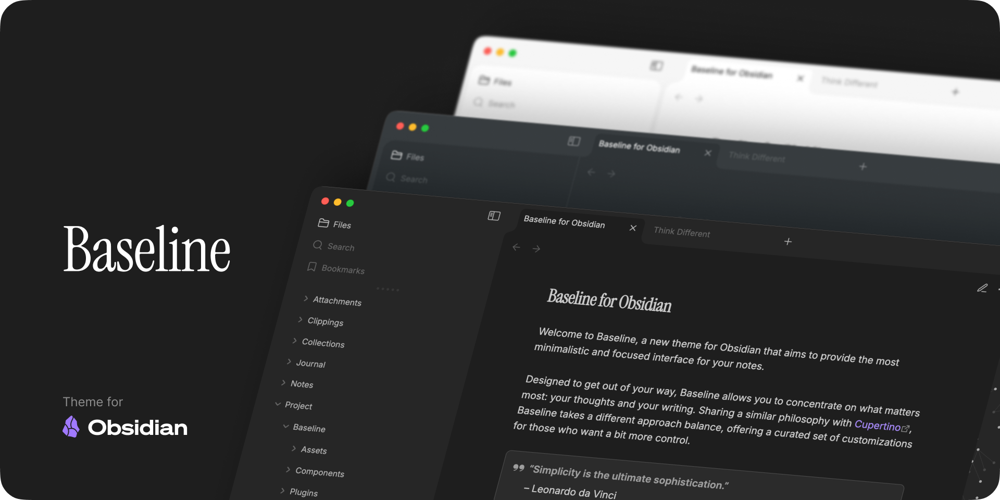

### From the creator of [Cupertino](https://github.com/aaaaalexis/obsidian-cupertino/)

Baseline sets a new standard for your Obsidian vault experience. Sleek, familiar, and effortlessly minimal, with endless ways to make it yours, where less becomes so much more.

[Support me and my work](https://www.buymeacoffee.com/sevenaxis) so I can keep regular updates and fixes. You’re also welcomed to submit pull requests.

## Coming from other themes?

Baseline provides a comprehensive [Style Settings Migration Tool](https://aaaaalexis.github.io/obsidian-baseline/), allowing you to seamlessly copy your settings from other themes over. As of now, following themes are supported:

- [Minimal](https://github.com/kepano/obsidian-minimal/) by kepano
- [AnuPpuccin](https://github.com/AnubisNekhet/AnuPpuccin/) by AnubisNekhet
- [Things 2](https://github.com/colineckert/obsidian-things/) by colineckert
- ...with more to come.

## Overview

- **Minimal interface** — Clean, organized look and feel, with playful animations and effects.

  

- **Beautifully yours** — Customize your own experience to your heart's content with [Style Settings](https://github.com/mgmeyers/obsidian-style-settings)

  

- **Optimized for mobile** — Redesigned modals, menu, editor, search, and more, with comfortable spacing for usability.

  

## Features

### Helper Class

Cupertino supports **all** helper classes (e.g. block width, cards, etc.) from [Minimal](https://github.com/kepano/obsidian-minimal). Please refer to [minimal.guide](https://minimal.guide) for all available features.

### Customization

Most features are enable by default, [Style Settings](https://github.com/mgmeyers/obsidian-style-settings)
is **_not_** required.

However, if you prefer to customize your own experience, Baseline provides most options from [Minimal](https://github.com/kepano/obsidian-minimal/), [AnuPpuccin](https://github.com/AnubisNekhet/AnuPpuccin/), and [Things 2](https://github.com/colineckert/obsidian-things/), with more to come.

## Philosophy

### Less _and_ more

As software design continues to evolve, Obsidian's interface is starting to show its age. A lot of the highly customizable themes stick to Obsidian's default style, while opinionated ones compromise on customizability.

A simple and modern customizable theme is created to fill the gap, with tools designed to make your transition more seamless, **Baseline** strives to become the baseline for Obsidian experience moving forward.

## Credits

- **kepano - [Minimal](https://github.com/kepano/obsidian-minimal)**: Cards, color schemes, image grids, image filters, table helpers
- **AnubisNekhet - [AnuPpuccin](https://github.com/AnubisNekhet/AnuPpuccin/)**: Color schemes

## Licensing

Baseline is licensed under the [MIT license](LICENSE).
